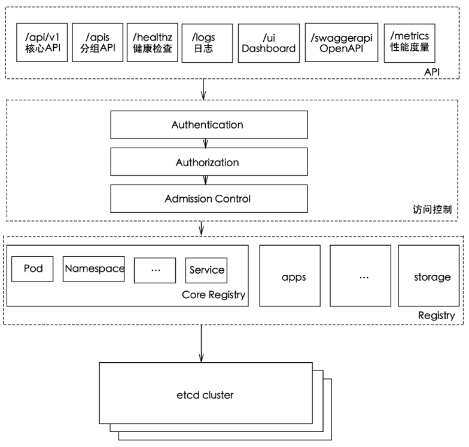

# 1. API Server简介

k8s API Server提供了k8s各类资源对象（pod,RC,Service等）的增删改查及watch等HTTP Rest接口，是整个系统的数据总线和数据中心。

kubernetes API Server的功能：

1. 提供了集群管理的`REST API`接口(包括认证授权、数据校验以及集群状态变更)；
2. 提供其他模块之间的数据交互和通信的枢纽（其他模块通过API Server查询或修改数据，只有API Server才直接操作etcd）;
3. 是资源配额控制的入口；
4. 拥有完备的集群安全机制.

**kube-apiserver工作原理图**



# 2. 如何访问kubernetes API

k8s通过kube-apiserver这个进程提供服务，该进程运行在单个k8s-master节点上。默认有两个端口。

## 2.1. 本地端口

1. 该端口用于接收HTTP请求；
2. 该端口默认值为`8080`，可以通过API Server的启动参数`--insecure-port`的值来修改默认值；
3. 默认的IP地址为`localhost`，可以通过启动参数`--insecure-bind-address`的值来修改该IP地址；
4. 非认证或授权的HTTP请求通过该端口访问API Server。

## 2.2. 安全端口

1. 该端口默认值为`6443`，可通过启动参数`--secure-port`的值来修改默认值；
2. 默认IP地址为非本地（Non-Localhost）网络端口，通过启动参数`--bind-address`设置该值；
3. 该端口用于接收`HTTPS`请求；
4. 用于基于`Tocken`文件或客户端证书及`HTTP Base`的认证；
5. 用于基于策略的授权；
6. 默认不启动`HTTPS`安全访问控制。

## 2.3. 访问方式

Kubernetes REST API可参考[https://kubernetes.io/docs/api-reference/v1.6/](https://kubernetes.io/docs/api-reference/v1.6/)

## 2.3.1. curl

```bash
curl localhost:8080/api
curl localhost:8080/api/v1/pods
curl localhost:8080/api/v1/services
curl localhost:8080/api/v1/replicationcontrollers
```

## 2.3.2. Kubectl Proxy

Kubectl Proxy代理程序既能作为API Server的**反向代理**，也能作为普通客户端访问API Server的代理。

通过master节点的8080端口来启动该代理程序。

`kubectl proxy --port=8080 &`

具体见kubectl proxy --help


## 2.3.3. kubectl客户端

命令行工具kubectl客户端，通过命令行参数转换为对API Server的REST API调用，并将调用结果输出。

命令格式：`kubectl [command] [options]`

具体可参考[k8s常用命令](http://wiki.haplat.net/pages/viewpage.action?pageId=11899446)

## 2.3.4. 编程方式调用

使用场景：

1. 运行在Pod里的用户进程调用kubernetes API,通常用来实现分布式集群搭建的目标。

2. 开发基于kubernetes的管理平台，比如调用kubernetes API来完成Pod、Service、RC等资源对象的图形化创建和管理界面。可以使用kubernetes提供的`Client Library`。

具体可参考[https://github.com/kubernetes/client-go](https://github.com/kubernetes/client-go)。

# 3. 通过API Server访问Node、Pod和Service

k8s API Server最主要的REST接口是资源对象的增删改查，另外还有一类特殊的REST接口—`k8s Proxy API`接口，这类接口的作用是代理`REST`请求
即kubernetes API Server把收到的REST请求转发到某个Node上的kubelet守护进程的REST端口上，由该kubelet进程负责响应。

## 3.1. Node相关接口

关于Node相关的接口的REST路径为：/api/v1/proxy/nodes/{name}，其中{name}为节点的名称或IP地址。

```bash
/api/v1/proxy/nodes/{name}/pods/    #列出指定节点内所有Pod的信息
/api/v1/proxy/nodes/{name}/stats/   #列出指定节点内物理资源的统计信息
/api/v1/prxoy/nodes/{name}/spec/    #列出指定节点的概要信息
```

这里获取的Pod信息来自Node而非etcd数据库，两者时间点可能存在偏差。如果在kubelet进程启动时加--enable-debugging-handles=true参数，那么kubernetes Proxy API还会增加以下接口：

```bash
/api/v1/proxy/nodes/{name}/run      #在节点上运行某个容器
/api/v1/proxy/nodes/{name}/exec     #在节点上的某个容器中运行某条命令
/api/v1/proxy/nodes/{name}/attach   #在节点上attach某个容器
/api/v1/proxy/nodes/{name}/portForward   #实现节点上的Pod端口转发
/api/v1/proxy/nodes/{name}/logs     #列出节点的各类日志信息
/api/v1/proxy/nodes/{name}/metrics  #列出和该节点相关的Metrics信息
/api/v1/proxy/nodes/{name}/runningpods  #列出节点内运行中的Pod信息
/api/v1/proxy/nodes/{name}/debug/pprof  #列出节点内当前web服务的状态，包括CPU和内存的使用情况
```

## 3.2. Pod相关接口

```bash
/api/v1/proxy/namespaces/{namespace}/pods/{name}/{path:*}      #访问pod的某个服务接口
/api/v1/proxy/namespaces/{namespace}/pods/{name}               #访问Pod
#以下写法不同，功能一样
/api/v1/namespaces/{namespace}/pods/{name}/proxy/{path:*}      #访问pod的某个服务接口
/api/v1/namespaces/{namespace}/pods/{name}/proxy               #访问Pod
```

## 3.3. Service相关接口

```bash
/api/v1/proxy/namespaces/{namespace}/services/{name}
```

Pod的proxy接口的作用：在kubernetes集群之外访问某个pod容器的服务（HTTP服务），可以用Proxy API实现，这种场景多用于管理目的，比如逐一排查Service的Pod副本，检查哪些Pod的服务存在异常问题。

# 4. 集群功能模块之间的通信

kubernetes API Server作为集群的核心，负责集群各功能模块之间的通信，集群内各个功能模块通过API Server将信息存入etcd，当需要获取和操作这些数据时，通过API Server提供的REST接口（GET/LIST/WATCH方法）来实现，从而实现各模块之间的信息交互。

## 4.1. kubelet与API Server交互

每个Node节点上的kubelet定期就会调用API Server的REST接口报告自身状态，API Server接收这些信息后，将节点状态信息更新到etcd中。

kubelet也通过API Server的Watch接口监听Pod信息，从而对Node机器上的POD进行管理。

| 监听信息             | kubelet动作          | 
| ---------------- | ------------------ | 
| 新的POD副本被调度绑定到本节点 | 执行POD对应的容器的创建和启动逻辑 |  
| POD对象被删除         | 删除本节点上相应的POD容器     |  
| 修改POD信息          | 修改本节点的POD容器        |  

## 4.2. kube-controller-manager与API Server交互

kube-controller-manager中的Node Controller模块通过API Server提供的Watch接口，实时监控Node的信息，并做相应处理。

## 4.3. kube-scheduler与API Server交互

Scheduler通过API Server的Watch接口监听到新建Pod副本的信息后，它会检索所有符合该Pod要求的Node列表，开始执行Pod调度逻辑。调度成功后将Pod绑定到目标节点上。

## 4.4. 特别说明

为了缓解各模块对API Server的访问压力，各功能模块都采用**缓存机制**来缓存数据，各功能模块定时从API Server获取指定的资源对象信息（LIST/WATCH方法），然后将信息**保存到本地缓存**，功能模块在某些情况下不直接访问API Server，而是通过访问缓存数据来间接访问`API Server`。

 

参考《kubernetes权威指南》
